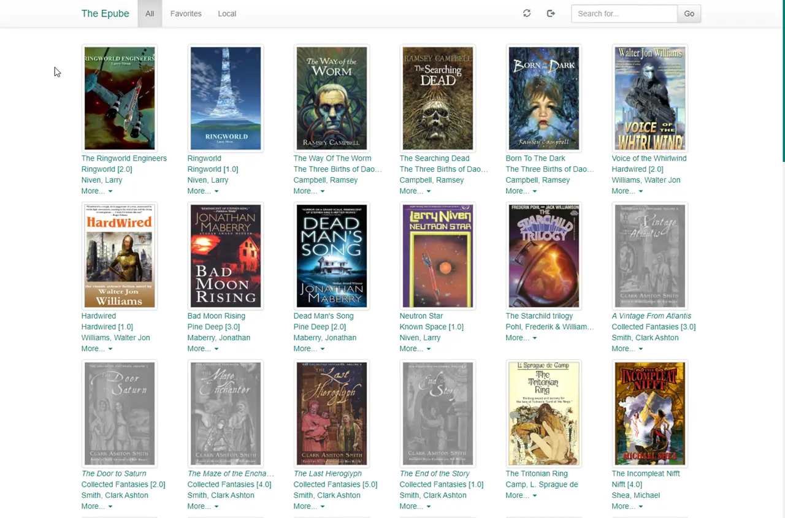

---
hide:
  - navigation
  - toc
---

# The Epube

Self-hosted web EPUB reader using [EPUB.js](https://github.com/futurepress/epub.js), Bootstrap, and [Calibre](https://calibre-ebook.com).

* responsive, offline-capable design;
* integrates with Calibre library;
* can use either SQLite or PostgreSQL for its own database;
* multi-device sync of last-read pages (when online);
* word definition lookups using dictd / Wiktionary;
* supports Chrome homescreen "app mode";
* optional hyphenation using [hyphen](https://github.com/ytiurin/hyphen) library;
* various themes, etc;

See also:

* [Demo](https://the-epube-demo.tt-rss.org/) (login as <code>demo</code>, <code>demo</code>; database is restored every six hours)
* [Android client (wrapper)](https://gitlab.tt-rss.org/main/the-epube-android)

## Screenshots

{ width="350", align=left } { width="131" }

## UI cheat sheet

* Switch pages: Left, Right, space, taps/clicks on left and right sides of the window
* Show UI if it's hidden: escape or tap somewhere in the middle of reader window
* Dictionary lookup: double click/select one word

## Installation

Use the following compose setup to either pull or build your own images:

### .env

```ini
# Put any local modifications here.

# Calibre library base directory (mounts to /books)
BOOKS_DIR=/home/user/calibre/Books

# Default user to create (if it doesn't exist)
EPUBE_ADMIN_USER=admin
EPUBE_ADMIN_PASS=password

# bind exposed port to 127.0.0.1 by default in case reverse proxy is used.
# if you plan to run the container standalone and need origin port exposed
# use next HTTP_PORT definition (or remove "127.0.0.1:").
HTTP_PORT=127.0.0.1:8280
#HTTP_PORT=8280
```

### docker-compose.yml

```yaml
version: '3'

services:
  # optional dictionary server (add other dictionaries via Dockerfile)
  # comment it out if you don't need it

  dict:
    restart: unless-stopped
    build:
      dockerfile: .docker/dict/Dockerfile
      context: https://git.tt-rss.org/fox/the-epube.git

  app:
    build:
      dockerfile: .docker/app/Dockerfile
      context: https://git.tt-rss.org/fox/the-epube.git
      args:
        BUILDKIT_CONTEXT_KEEP_GIT_DIR: 1
    restart: unless-stopped
    env_file:
      - .env
    volumes:
      - app:/var/www/html
      - ${BOOKS_DIR}:/books:ro

  web-nginx:
    build:
      dockerfile: .docker/web-nginx/Dockerfile
      context: https://git.tt-rss.org/fox/the-epube.git
    restart: unless-stopped
    ports:
      - ${HTTP_PORT}:8080
    volumes:
      - app:/var/www/html:ro
    depends_on:
      - app

volumes:
  app:
```

For host installation, see [README.md](https://git.tt-rss.org/fox/the-epube.git/tree/README.md)

## FAQ

### Moving between pages is slow with some books

This happens sometime on slow devices, i.e. phones. The usual reason is Epub chapters are too large. Those can be split into smaller sections with Calibre epub converter: *EPUB Output -> Split files larger than ->* set a smaller value, 100KB should be fine.