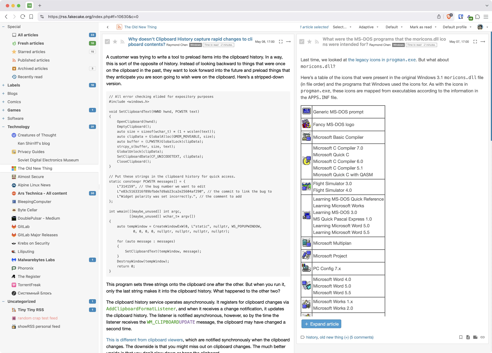
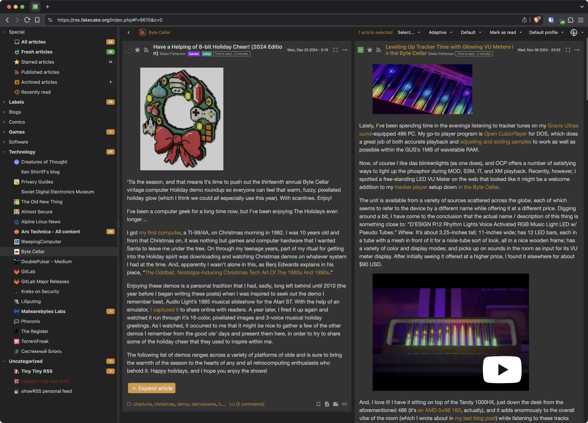
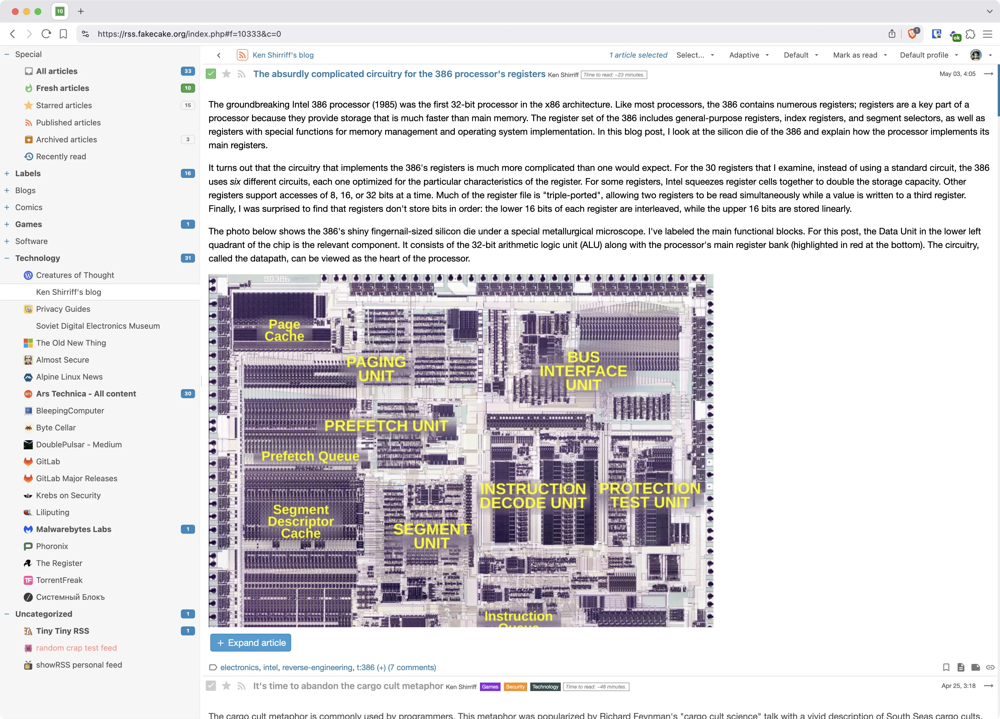
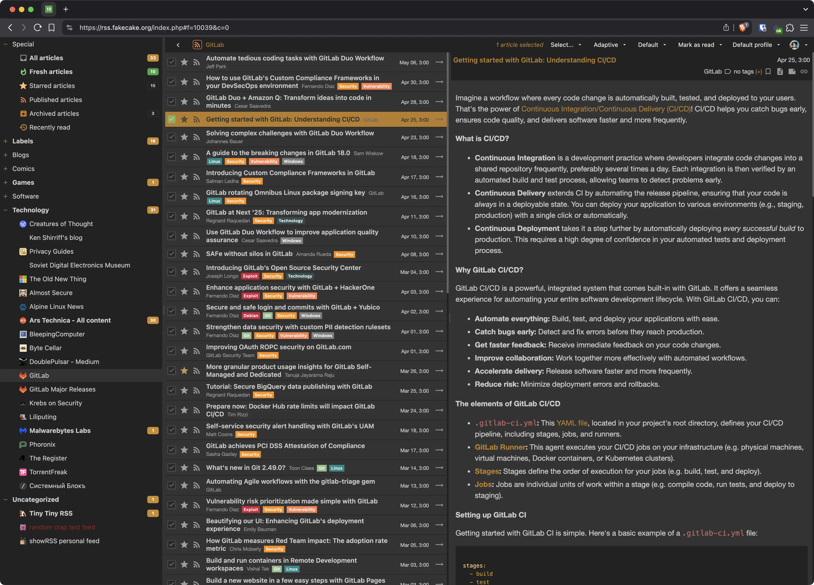

---
hide:
  - navigation
  - toc
---

Tiny Tiny RSS is a free and open source web-based news feed (RSS/Atom) reader and aggregator.

## Screenshots

{ width="350", align=left }
{ width="350", align=left }
{ width="350", align=left }
{ width="350" }

## Features

-   Free software, licensed under [GNU GPLv3](http://www.gnu.org/copyleft/gpl.html);
-   Self-hosted: control your own data and protect your privacy instead of relying on third party services;
-   Supports:
    -   organizing feeds by folders (and subfolders),
    -   [feed aggregation / syndication](wiki/GeneratedFeeds.md),
    -   keyboard shortcuts,
    -   OPML import/export,
    -   multiple ways to share stuff: export RSS feeds, plugins for various social sites, sharing by URL, etc,
    -   [sharing arbitrary content through tt-rss](wiki/ShareAnything.md),
    -   [Plugins](Plugins.md) and [themes](Themes.md),
    -   embedding full article content via readability and site-specific plugins,
    -   deduplication, including [perceptual hashing](https://git.tt-rss.org/fox/ttrss-perceptual-image-hash) for images,
    -   podcasts,
    -   [flexible article filtering](wiki/ContentFilters.md),
    -   [JSON API](ApiReference.md),
    -   and [much more](https://gitlab.tt-rss.org/tt-rss/plugins)…
-   [Android client](AndroidClient.md);

## Demo

See [here](https://demo.tt-rss.org/) (login as ``demo``, ``demo``). Resets every two hours which might log you out.

## Development

* [CGit](https://git.tt-rss.org) is recommended to checkout code from;
* [Gitlab](https://gitlab.tt-rss.org/tt-rss/tt-rss) is where development is happening;

## Get in touch

Join [community forums](https://community.tt-rss.org/) if you have questions or need to report a bug.

<small>If you absolutely need to contact me directly because of something important (i.e. responsible disclosure of a security issue), use [this](mailto:cthulhoo@gmail.com) email address.</small>

## Contribute

* Help translate tt-rss into your own language using [Weblate](https://hosted.weblate.org/engage/tt-rss/);
* [Code contribution guidelines](https://gitlab.tt-rss.org/tt-rss/tt-rss/-/blob/master/CONTRIBUTING.md?ref_type=heads);

## Installation

You will need the following:

* A modern web browser. This generally means recent Chrome or compatible;
* A server (VDS or physical) running Docker;

### [Docker installation guide](wiki/InstallationNotes.md)

Tiny Tiny RSS uses continuous development model based on [git master branch](https://git.tt-rss.org/fox/tt-rss.git/) which is considered stable. If possible, you should always be running latest master branch code.

There’s no warranty. If it breaks you get to keep both parts.
